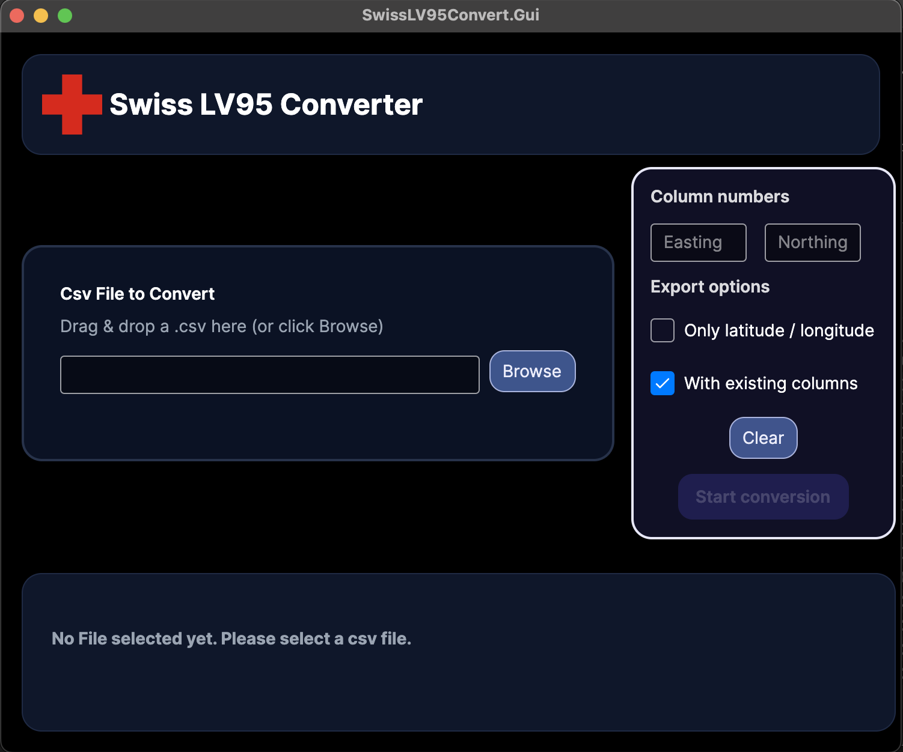

# SwissLV95Convert
[](https://github.com/)
[](LICENSE)
[](https://dotnet.microsoft.com/)
[](https://github.com/)

<p align="center">
  
</p>


Convert Swiss LV95 (CH1903+) coordinates to WGS84 from CSV files. Includes a CLI for batch use and a work-in-progress Avalonia GUI.

## Screenshot


## 🎥 Demo
<video src="docs/vd/demo.mov" controls width="800"></video>


## Why you need it

Many Swiss public datasets and geospatial services use the Swiss LV95 (CH1903+) coordinate system. LV95 uses projected coordinates (eastings/northings) that are not directly compatible with global geographic coordinate systems such as WGS84 (latitude/longitude) used by web maps (MapLibre, Google Maps, Leaflet, etc.). This project provides a simple, precise converter so you can:

- Transform CSV datasets from LV95 to WGS84 for visualization on global basemaps.
- Integrate Swiss government data into web maps, GIS tools, or data pipelines without manual reprojection.
- Keep numeric precision and handle CSV column layouts commonly found in exported datasets.

Provided CLI and GUI interfaces make the conversion easy.

Official Swisstopo documentation: https://www.swisstopo.admin.ch/en/the-swiss-coordinates-system

## Project structure
```
SwissLV95Convert/
├── SwissLV95Convert.sln
├── src/
│   ├── SwissLV95Convert.Core/
│   │   └── SwissLV95Convert.Core.csproj
│   └── SwissLV95Convert.Cli/
│       └── SwissLV95Convert.Cli.csproj
│   └── SwissLV95Convert.Gui/
│       └── SwissLV95Convert.Gui.csproj
├── README.md
├── LICENSE
└── .gitignore
```

## Features
- LV95 (MN95) -> WGS84 conversion
- CSV input/output
- CLI for scripting and batch processing
- Cross-platform GUI (Avalonia) for better ans simple experience

## Quick start

1. Restore and build the solution:
```bash
dotnet restore
dotnet build
```

2. CLI example:
```bash
cd src/SwissLV95Convert.Cli
dotnet build
dotnet run 
# mode: 1 = LV95 → WGS84
```

3. GUI (development):
- Build the Gui project:
```bash
cd src/SwissLV95Convert.Gui
dotnet build
dotnet run
```
- For Avalonia Preview in VS Code: build the solution first (`dotnet build`), then open the preview.

## Contributing
Issues and PRs welcome. Please follow standard GitHub workflow.

## License
MIT — see LICENSE for details.